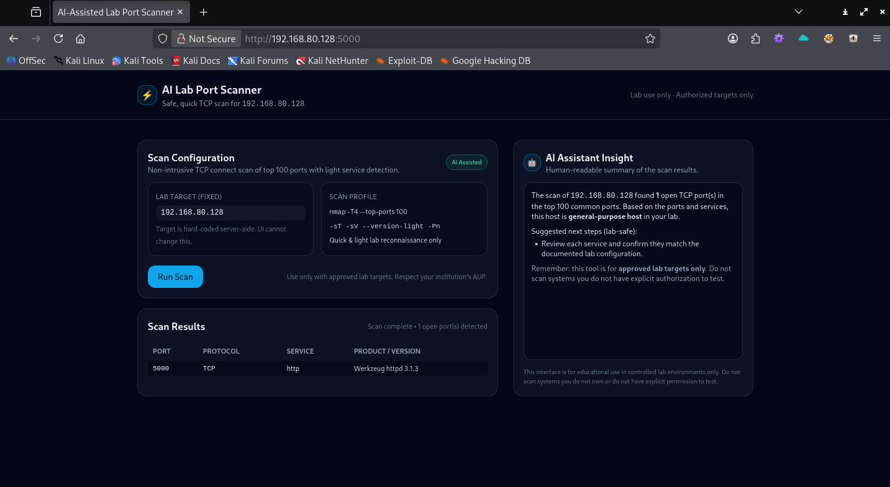

# AI-Assisted Lab Port Scanner

This project is a small AI-style web interface for **basic, safe port scanning** of an assigned lab target.  
The target host is fixed on the backend and cannot be changed from the UI.

> ⚠️ **Lab Targets Only**  
> This tool is for approved lab environments only.  
> Do **not** scan systems you do not own or do not have explicit permission to test.

---

## How It Works

- Backend: Python + Flask (`server.py`)
- Frontend: HTML + Tailwind + JavaScript
- Target: hard-coded via `LAB_TARGET` in `server.py` (or the `LAB_TARGET` environment variable)
- Scan command (run on the server):

  ```bash
  nmap -T4 --top-ports 100 -sT -sV --version-light -Pn -oX - <LAB_TARGET>

---

## Screenshot

Below is a screenshot of the AI-Assisted Lab Port Scanner running against the approved lab target (Kali VM in this case):


